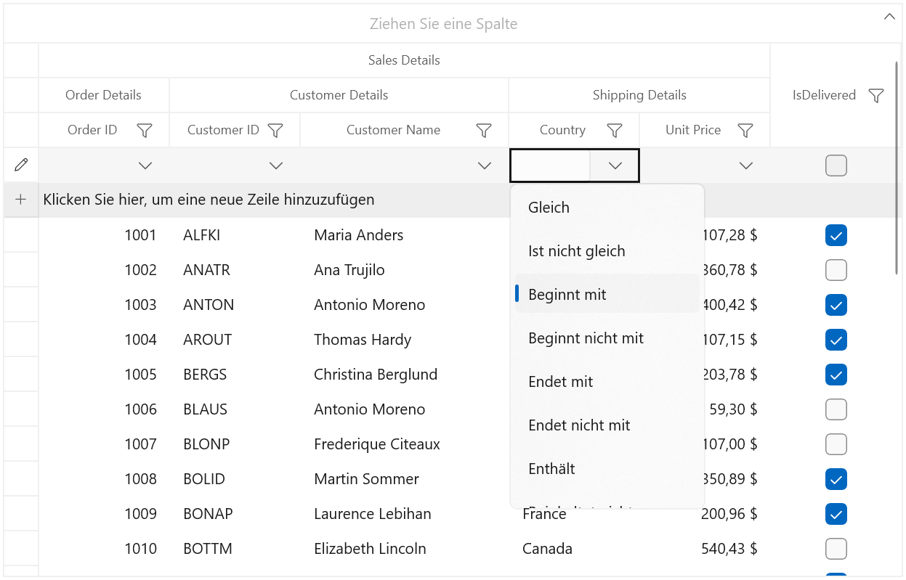
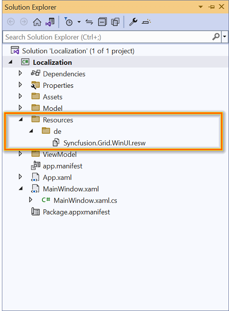
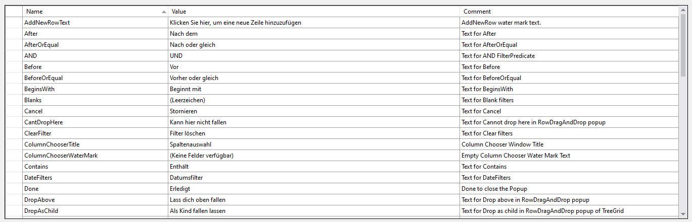

# Localization in WinUI DataGrid

This repository contains sample which shows [localization](https://help.syncfusion.com/winui/localization) of Syncfusion [WinUI DataGrid](https://www.syncfusion.com/winui-controls/datagrid) (SfDataGrid).

Localization is the process of making an application multilingual by formatting the content according to the languages. This involves configuring the application for a specific language.

### Changing application language

The application language can be changed by setting the desired language to the `ApplicationLanguages.PrimaryLanguageOverride` property in the constructor of the main window. Localization can be done while changing the application language by creating a .resw file.

``` csharp
public sealed partial class MainWindow : Window
{
    public MainWindow()
    {
        Windows.Globalization.ApplicationLanguages.PrimaryLanguageOverride = "de";
        this.InitializeComponent();
    }
}
```

You can use the below code for packaged deployments. But in unpackaged deployments, it may cause the app to crash.

``` csharp
public sealed partial class MainWindow : Window
{
    public MainWindow()
    {
        // This code works for packaged deployments, but in unpackaged deployments, it may cause the app to crash.
        Windows.Globalization.ApplicationLanguages.PrimaryLanguageOverride = "de"; 
        this.InitializeComponent();
    }
}
```

**Note:** We recommend setting the above code before the `InitializeComponent` method if you have added a .resw file to your project. Otherwise, it may cause the project to crash.

The following screenshot illustrates how the localization is applied to the datagrid based on the defined language to the `ApplicationLanguages.PrimaryLanguageOverride` property.



### Creating .resw files

The following steps can be used to generate .resw files for any language:

**Note:** The default resource files of all Syncfusion® WinUI libraries can be obtained from [GitHub](https://github.com/syncfusion/winui-controls-localization-resource-files).

1. Right-click the project and add a New folder named as "Resources".

2. Add another folder and name the folder with "language name". For example, "de" for German language.

3. Add [default resource files](https://github.com/syncfusion/winui-controls-localization-resource-files) in the following structure.



**Note:** If the SfDataGrid control is used in the application, copy and paste the `Syncfusion.Grid.WinUI.resw` (SfDataGrid present in the Syncfusion.Grid.WinUI library) file into the application under Resources folder. So, now you know the key names and values of the default strings in the Syncfusion.Grid.WinUI library.

4. Now, the key names from default resource files can be defined and assigned values based on language.


