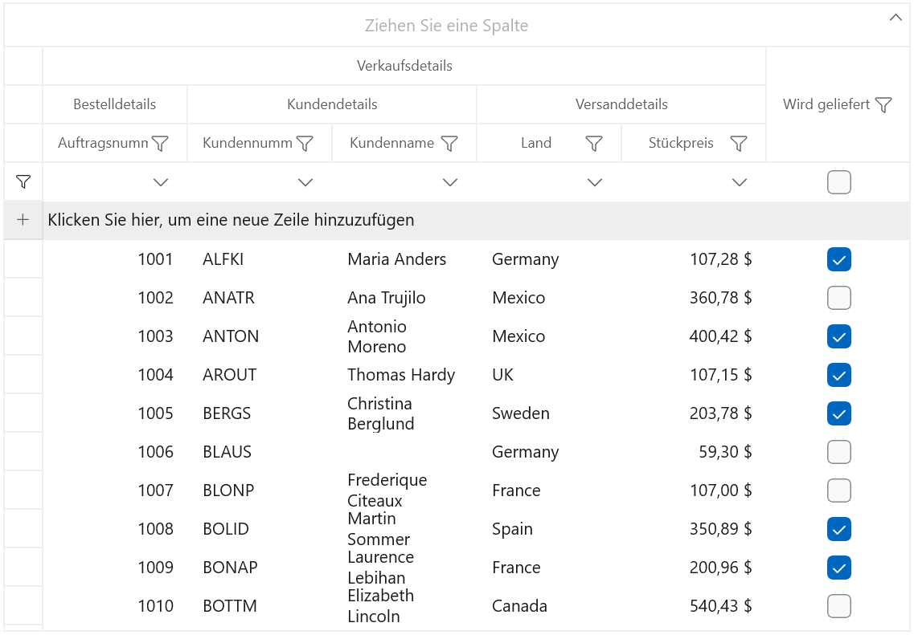

# Localization in WinUI DataGrid (SfDataGrid)

This repository contains sample which shows [localization](https://help.syncfusion.com/winui/localization) of Syncfusion WinUI DataGrid (SfDataGrid).

Localization is the process of making an application multilingual by formatting the content according to the languages. This involves configuring the application for a specific language.

### Changing application language

The application language can be changed by setting the desired language to the `ApplicationLanguages.PrimaryLanguageOverride` property in the constructor of the main window. Localization can be done while changing the application language by creating a .resw file.

``` csharp
public sealed partial class MainWindow : Window
{
    public MainWindow()
    {
        Windows.Globalization.ApplicationLanguages.PrimaryLanguageOverride = "de";
        this.InitializeComponent();
    }
}
```

The following screenshot illustrates how the localization is applied to the datagrid based on the defined language to the `ApplicationLanguages.PrimaryLanguageOverride` property.

### Creating .resw files

The following steps can be used to generate .resw files for any language:

1. Right-click the project and add a New folder named as “Resources”.

2. Add another folder and name the folder with “language name”. For example, “de” for German language. Find the supported culture codes from [here](https://docs.microsoft.com/en-us/windows/uwp/app-resources/how-rms-matches-lang-tags).

3. Add [default resource files](https://github.com/syncfusion/winui-controls-localization-resource-files) in the following structure.

4. Now, the key names from default resource files can be defined and assigned values based on language.

